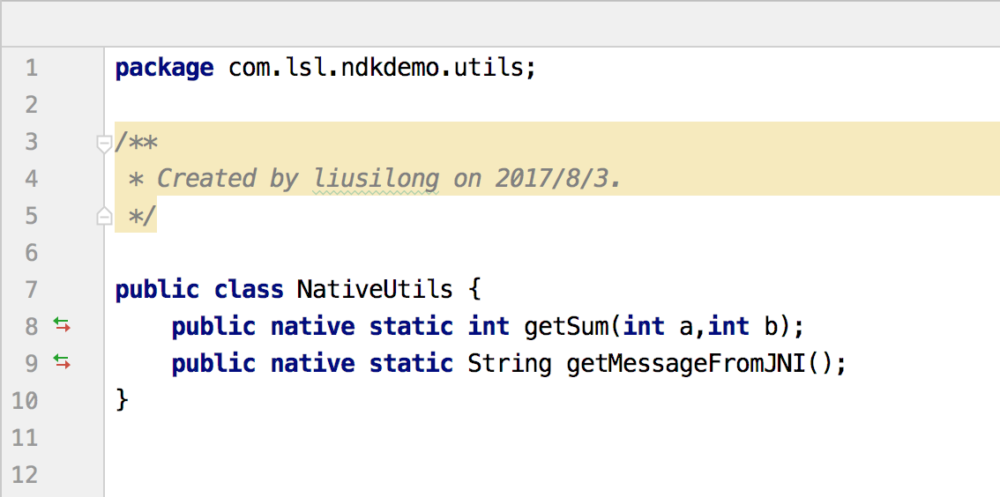

### Android Studio 使用NDK
-
+ 官方文档
    + [官方文档](https://developer.android.com/studio/projects/add-native-code.html?hl=zh-cn)
+ 首先要按照官方文档下载**NDK、CMake、LLDB**这些工具
+ Android Studio开发NDK是可能遇到C++代码不提示的情况这个时候就得看看Plugins里面是否勾选如下选项

    
**步骤**
-
+ 新建项目，勾选Include C++ support 如下

    
+ 到最后一步的时候勾选如下两项

    
+ 到这里项目创建好了，然后新建一个类(这里叫做`NativeUtils`)里面声明native方法，如下：

    
+ 接下来为这个类生产头文件，使用如下命令
    + 首先进入到`app/src/main/java`目录了下
    + `javah -d ../jni -jni com.lsl.ndkdemo.utils.NativeUtils`
    + 这样就会将产生的头文件输出到jni目录中，如下
    
    + 然后新建cpp文件，将头文件里面的方法拷贝到cpp文件中去实现即可
+ 接着看CMakeLists.txt的配置

    
    
+ 接着看build.gradle里面的配置
    + 在defaultConfig代码块中添加
        
+ 然后在使用到native方法的类里面加载so库，我们这里是在`NativeUtils`类中使用的则
    
    
+ 最后调用native方法
    
    
+ 编译好的so库的位置在这里    
    
    
    
**使用上面编译好的so库**
-
+ 首先还是新建一个Android项目
+ 然后在main目录下新建jniLibs目录，将so库拷贝进去
    
+ 然后新建一个类，**注意这个类必须和产生头文件时的类的包名和类名一样**。例如上面调用native方法的内的完整的包路径为`com.lsl.ndkdemo.utils.NativeUtils`,所以在使用人家的so库的时候在项目中也需要新建一个这样的类如下：
    
+ 使用如下：
        

     

    
    

