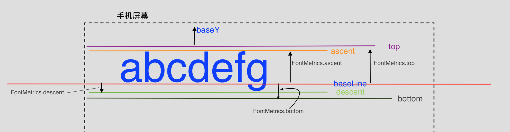
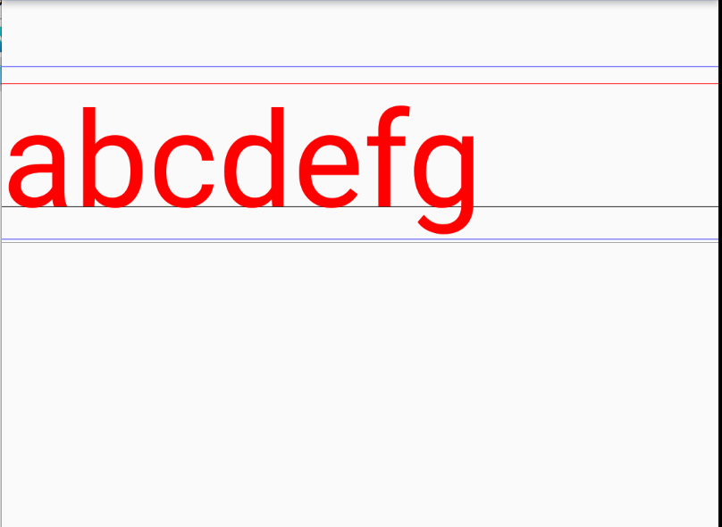

## TextView 中的几条线
+ 如图

     
     
     + 图中的虚线框表示手机屏幕
     + baseY就是文本距离屏幕顶部的距离
     + 接着分别是top、ascent、baseLine、descent、bottom
     + 这几个值怎么计算呢，在Paint中有API的如下
     + `Paint.FontMetrics fm = paint.getFontMetrics();`
     + 里面分别有：
     + fm.top
     + fm.ascent
     + fm.descent
     + fm.bottom
     + baseLine API里面没有，这里需要计算，因为上面几个值都是相对于baseLine的，所以可以把baseLine想象成原点，原点之上为负值，原点之下为正值
     + 所以有 fm.top 和 fm.ascent 为负值；fm.descent 和 fm.bottom 为正值
     + 从图中可以看出baseLine的Y坐标等于baseY加上fm.top，而fm.top又为负值，所以
     + baseLineY = baseY - fm.top
     + 响应的其他几条线的Y坐标分别为
     + ascentY = baseLineY + fm.ascent
     + descentY = baseLineY + fm.descent
     + bottomY = baseLineY + fm.bottom
+ 实例代码如下
    
    ```java
     @Override
    protected void onDraw(Canvas canvas) {
        super.onDraw(canvas);
        int baseY = 100;
        int baselineX = 0;
        paint.setTextSize(200);
        paint.setTextAlign(Paint.Align.LEFT);
        paint.setColor(Color.BLUE);
        
        Paint.FontMetrics fm = paint.getFontMetrics();
    //        基线的Y坐标
        float baselineY = baseY - fm.top;
        float ascentY = baselineY + fm.ascent;
        float descentY = baselineY + fm.descent;
        float bottomY = baselineY + fm.bottom;
    //        top
        canvas.drawLine(0, baseY, 2000, baseY, paint);
    //        ascent
        paint.setColor(Color.RED);
        canvas.drawLine(0, ascentY, 2000, ascentY, paint);
    //        baseline
        paint.setColor(Color.BLACK);
        canvas.drawLine(0, baselineY, 2000, baselineY, paint);
    //        descent
        paint.setColor(Color.BLUE);
        canvas.drawLine(0, descentY, 2000, descentY, paint);
    //        bottom
        paint.setColor(Color.GRAY);
        canvas.drawLine(0, bottomY, 2000, bottomY, paint);
        
        paint.setColor(Color.RED);
        canvas.drawText(str, baselineX, baselineY, paint);
    }
    ```
    效果如下：
    